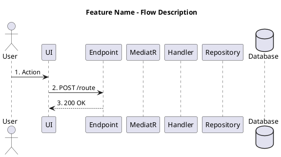

# Prompt Template: Generate PlantUML Sequence Diagram for FDA API Feature

## 🎯 Objective
Generate a clear and concise PlantUML Sequence Diagram for a specific feature in the FDA API project following Domain-Centric Architecture (Clean Architecture + CQRS pattern).

---

## 📋 Prompt Template

```
Tạo PlantUML Sequence Diagram cho feature [FEATURE_CODE] - [FEATURE_NAME] của dự án FDA API.

**Context dự án:**
- Architecture: Domain-Centric Architecture (Clean Architecture + CQRS)
- Pattern: MediatR CQRS (IRequest/IRequestHandler)
- Framework: ASP.NET Core 8.0 + FastEndpoints
- Database: PostgreSQL với Entity Framework Core
- Authentication: JWT Bearer

**Yêu cầu diagram:**

1. **Participants (GIỚI HẠN TỐI ĐA 8):**
   - actor User
   - participant UI
   - participant [FeatureName]Endpoint
   - participant MediatR
   - participant [FeatureName]Handler
   - participant Repository (gộp tất cả repositories thành 1 participant)
   - participant Service (gộp tất cả services thành 1 participant, chỉ khi cần)
   - database Database

   **QUAN TRỌNG:**
   - Tối đa 8 participants (actor + participant + database)
   - Luôn gộp repositories thành 1 participant "Repository"
   - Luôn gộp services thành 1 participant "Service" (nếu có)

2. **GIỚI HẠN ALT CONDITIONS: Tối đa 2 cấp alt**
   - 1 alt chính (VD: success vs failure)
   - 1 alt nested bên trong (VD: user exists vs not exists)
   - KHÔNG được vượt quá 2 cấp alt

3. **GIỚI HẠN SỐ MŨI TÊN: 20-25 mũi tên**
   - Mục tiêu: 20-25 mũi tên (hướng tới và trả về)
   - Chỉ khi sequence quá phức tạp mới xét đến 25-30 mũi tên
   - Nếu vượt quá 30, cần tách thành nhiều diagrams

4. **Mức độ chi tiết: ĐƠN GIẢN**
   - ✅ Đánh số thứ tự các bước (1, 2, 3, ...)
   - ✅ Hiển thị rõ ràng luồng request/response
   - ✅ Mỗi database operation phải có arrow đến Database
   - ✅ Method names ngắn gọn (GetUser thay vì GetByEmailAsync)
   - ❌ KHÔNG cần activate/deactivate lifeline
   - ❌ KHÔNG cần group boxes
   - ❌ KHÔNG quá chi tiết (mỗi field validation)
   - ❌ KHÔNG show tất cả error paths, chỉ show main error path

5. **Alt conditions chỉ dùng khi:**
   - Có nhiều hơn 1 kết quả có thể xảy ra (success/failure)
   - Authentication/Authorization checks
   - Business rules QUAN TRỌNG
   - Không show tất cả error cases, chỉ show main error path

6. **Cấu trúc mỗi flow:**
   ```
   @startuml [FlowName]
   title [Feature Name] - [Flow Description]

   actor User
   participant UI
   participant [Endpoint]
   participant MediatR
   participant [Handler]
   participant Repository
   participant Service
   database Database

   User -> UI: 1. [User action]
   UI -> Endpoint: 2. POST/GET/PUT/DELETE [route]
   Endpoint -> MediatR: 3. Send([Request])
   MediatR -> Handler: 4. Handle(request)

   Handler -> Repository: 5. [RepositoryMethod]
   Repository -> Database: 6. [SQL operation]
   Database --> Repository: 7. [Result]
   Repository --> Handler: 8. [Result]

   alt [Condition failure]
     Handler --> MediatR: 9. [Response] {success: false}
     MediatR --> Endpoint: 10. [Response]
     Endpoint --> UI: 11. [HTTP Status]
     UI --> User: 12. [Error message]
   else [Condition success]
     [... more steps ...]
     Handler --> MediatR: N. [Response] {success: true, data}
     MediatR --> Endpoint: N+1. [Response]
     Endpoint --> UI: N+2. 200 OK
     UI --> User: N+3. [Success message]
   end

   @enduml
   ```

7. **Naming conventions:**
   - Request arrows: `->` (solid line)
   - Return arrows: `-->` (dashed line)
   - Alt blocks: `alt [condition]` / `else [condition]` / `end`
   - Database operations: rõ ràng (SELECT, INSERT, UPDATE, DELETE)
   - Method names: ngắn gọn (GetUser, CreateUser, VerifyPassword)
   - HTTP routes: ngắn gọn (POST /api/auth/login)
   - Status codes: 200 OK, 401 Unauthorized, 403 Forbidden, 404 Not Found

8. **Số lượng flows:**
   - Nếu feature có nhiều flows khác nhau (VD: OTP Login vs Password Login), tạo riêng từng `@startuml` block
   - Mỗi flow có title riêng
   - Đặt cách nhau bằng 1 dòng trắng

**Feature cần tạo diagram:**
- Feature Code: [FEATURE_CODE]
- Feature Name: [FEATURE_NAME]
- Feature Description: [MÔ TẢ CHI TIẾT FEATURE]
- Main Flow(s): [DANH SÁCH CÁC FLOWS CHÍNH]

**Các file source code liên quan:**
- Endpoint: [ĐỊA CHỈ FILE ENDPOINT]
- Handler: [ĐỊA CHỈ FILE HANDLER]
- Repositories: [DANH SÁCH REPOSITORIES]
- Services: [DANH SÁCH SERVICES (nếu có)]

**Business Logic quan trọng:**
- [Validation rules]
- [Authentication/Authorization requirements]
- [Success conditions]
- [Failure conditions]
- [Side effects (email, notifications, etc.)]

**Output format:**
- File PlantUML (.puml) có thể render được
- Lưu vào: d:\Capstone Project\FDA_API\documents\Sequence.Diagram\[FEATURE_CODE]_[FeatureName].puml
- Syntax hoàn chỉnh, không có lỗi
- Có thể preview trực tiếp trong VSCode với PlantUML extension
- Mỗi flow là 1 `@startuml` block riêng biệt

**Reference example:**
Tham khảo cấu trúc từ file: d:\Capstone Project\FDA_API\documents\Sequence.Diagram\FeatG7_AuthLogin.puml
```

---

## 🔧 Cách sử dụng Prompt

### Bước 1: Điền thông tin feature
Thay thế các placeholder trong prompt:
- `[FEATURE_CODE]`: Mã feature (VD: FeatG28)
- `[FEATURE_NAME]`: Tên feature (VD: GetMapPreferences)
- `[MÔ TẢ CHI TIẾT FEATURE]`: Mô tả chi tiết về feature
- `[DANH SÁCH CÁC FLOWS CHÍNH]`: Các flows chính (VD: Happy path, Error path)
- `[ĐỊA CHỈ FILE ENDPOINT]`: Path đến endpoint file
- `[ĐỊA CHỈ FILE HANDLER]`: Path đến handler file
- `[DANH SÁCH REPOSITORIES]`: Các repositories sử dụng
- `[DANH SÁCH SERVICES]`: Các services sử dụng (nếu có)

### Bước 2: Paste prompt vào Claude
Copy toàn bộ prompt đã điền thông tin và paste vào Claude Code

### Bước 3: Verify output
- Kiểm tra file .puml được tạo ra
- Preview trong VSCode với PlantUML extension (Alt+D)
- Verify các flows, alt conditions có đầy đủ không

---

## 📝 Example Usage

### Example 1: FeatG28_GetMapPreferences

```
Tạo PlantUML Sequence Diagram cho feature FeatG28 - GetMapPreferences của dự án FDA API.

**Context dự án:**
- Architecture: Domain-Centric Architecture (Clean Architecture + CQRS)
- Pattern: MediatR CQRS (IRequest/IRequestHandler)
- Framework: ASP.NET Core 8.0 + FastEndpoints
- Database: PostgreSQL với Entity Framework Core
- Authentication: JWT Bearer (Required)

**Yêu cầu diagram:**
[... giống như trên ...]

**Feature cần tạo diagram:**
- Feature Code: FeatG28
- Feature Name: GetMapPreferences
- Feature Description: API endpoint để lấy map preferences của authenticated user (baseMap, layers, zoom, center)
- Main Flow(s):
  1. Get preferences (user has preferences saved)
  2. Get preferences (user has no preferences - return default)

**Các file source code liên quan:**
- Endpoint: src/External/Presentation/.../FeatG28_GetMapPreferences/GetMapPreferencesEndpoint.cs
- Handler: src/Core/Application/FDAAPI.App.FeatG28_GetMapPreferences/GetMapPreferencesHandler.cs
- Repositories: IUserPreferenceRepository
- Services: None

**Business Logic quan trọng:**
- Requires authentication (JWT token)
- If no preferences found, return default values
- PreferenceKey = "map_preferences"
- PreferenceValue is JSONB

**Output format:**
- Lưu vào: d:\Capstone Project\FDA_API\documents\Sequence.Diagram\FeatG28_GetMapPreferences.puml
```

### Example 2: FeatG29_UpdateMapPreferences

```
Tạo PlantUML Sequence Diagram cho feature FeatG29 - UpdateMapPreferences của dự án FDA API.

**Feature cần tạo diagram:**
- Feature Code: FeatG29
- Feature Name: UpdateMapPreferences
- Feature Description: API endpoint để update/create map preferences của authenticated user
- Main Flow(s):
  1. Update existing preferences
  2. Create new preferences (if not exists)

**Các file source code liên quan:**
- Endpoint: src/External/Presentation/.../FeatG29_UpdateMapPreferences/UpdateMapPreferencesEndpoint.cs
- Handler: src/Core/Application/FDAAPI.App.FeatG29_UpdateMapPreferences/UpdateMapPreferencesHandler.cs
- Repositories: IUserPreferenceRepository
- Services: None

**Business Logic quan trọng:**
- Requires authentication (JWT token)
- Validate baseMap: "standard", "satellite", "terrain", "hybrid"
- Validate zoom: 1-20
- Validate center coordinates
- Upsert operation (update if exists, insert if not)

**Output format:**
- Lưu vào: d:\Capstone Project\FDA_API\documents\Sequence.Diagram\FeatG29_UpdateMapPreferences.puml
```

### Example 3: FeatG6_SendOTP

```
Tạo PlantUML Sequence Diagram cho feature FeatG6 - SendOTP của dự án FDA API.

**Feature cần tạo diagram:**
- Feature Code: FeatG6
- Feature Name: SendOTP
- Feature Description: Send OTP code to phone number via SMS
- Main Flow(s):
  1. Send OTP to new phone number
  2. Send OTP to existing phone number (rate limit check)

**Các file source code liên quan:**
- Endpoint: src/External/Presentation/.../FeatG6_AuthSendOtp/SendOtpEndpoint.cs
- Handler: src/Core/Application/FDAAPI.App.FeatG6_AuthSendOtp/SendOtpHandler.cs
- Repositories: IOtpCodeRepository
- Services: ISmsService (Twilio)

**Business Logic quan trọng:**
- Rate limiting: Max 3 OTP requests per phone per 5 minutes
- OTP expires after 5 minutes
- OTP is 6-digit random number
- Send via Twilio SMS API
- Store OTP in database with expiry

**Output format:**
- Lưu vào: d:\Capstone Project\FDA_API\documents\Sequence.Diagram\FeatG6_SendOTP.puml
```

---

## ✅ Checklist

Khi tạo diagram xong, verify các items sau:

- [ ] File .puml syntax đúng, không có lỗi
- [ ] **Tối đa 8 participants** (actor + participant + database)
- [ ] Repositories được gộp thành 1 participant "Repository"
- [ ] Services được gộp thành 1 participant "Service" (nếu có)
- [ ] **Tối đa 2 cấp alt** (1 alt chính + 1 nested alt)
- [ ] **Số mũi tên: 20-25** (tối đa 25-30 nếu thật sự cần)
- [ ] Mỗi bước được đánh số thứ tự rõ ràng (1, 2, 3, ...)
- [ ] Request arrows dùng `->`, response arrows dùng `-->`
- [ ] Database operations rõ ràng (SELECT, INSERT, UPDATE, DELETE)
- [ ] Method names ngắn gọn (GetUser, CreateUser)
- [ ] HTTP status codes chính xác (200, 401, 403, 404)
- [ ] Mỗi flow có title ngắn gọn
- [ ] Có thể preview trong VSCode PlantUML extension
- [ ] File được lưu đúng vị trí: `documents/Sequence.Diagram/[FeatureCode]_[FeatureName].puml`

---

## 🎨 PlantUML Syntax Reference

### Basic Structure


### Alt Conditions
```plantuml
alt Condition A
  Handler --> UI: Error message
else Condition B
  Handler --> UI: Success message
end
```

### Nested Alt
```plantuml
alt User NOT exists
  Handler --> UI: 404 Not Found
else User exists
  alt Password mismatch
    Handler --> UI: 401 Unauthorized
  else Password matches
    Handler --> UI: 200 OK
  end
end
```

### Self-call
```plantuml
Handler -> Handler: Validate input
```

### Database Operations
```plantuml
Repository -> Database: SELECT * FROM users
Database --> Repository: User
```

---

## 💡 Tips

1. **Tuân thủ giới hạn**: Luôn nhớ 8 participants, 2 cấp alt, 20-25 mũi tên
2. **Start simple**: Tạo happy path trước, sau đó mới thêm 1 alt condition chính
3. **Number steps clearly**: Đánh số từ 1, giúp dễ trace flow
4. **Short method names**: GetUser thay vì GetByEmailAsync, CreateUser thay vì CreateAsync
5. **Database operations**: Luôn show SQL operation (SELECT, INSERT, UPDATE, DELETE)
6. **Gộp participants**: Luôn gộp repositories thành "Repository", services thành "Service"
7. **Limit alt nesting**: Tối đa 2 cấp (1 alt chính + 1 nested)
8. **Count arrows**: Đếm số mũi tên, nếu vượt 30 thì tách diagram
9. **Preview frequently**: Preview trong VSCode để catch lỗi sớm
10. **Keep it simple**: Đơn giản hơn luôn tốt hơn phức tạp

---

## 📚 Common Patterns

### Pattern 1: Authentication Required
```plantuml
UI -> Endpoint: POST /api/resource (with JWT)
Endpoint -> Endpoint: Validate JWT token
alt Token invalid
  Endpoint --> UI: 401 Unauthorized
else Token valid
  [... continue flow ...]
end
```

### Pattern 2: Upsert Operation
```plantuml
Handler -> Repository: GetByIdAsync
Repository -> Database: SELECT
Database --> Repository: Record or null

alt Record exists
  Handler -> Repository: UpdateAsync
  Repository -> Database: UPDATE
else Record NOT exists
  Handler -> Repository: CreateAsync
  Repository -> Database: INSERT
end
```

### Pattern 3: Validation
```plantuml
Handler -> Handler: Validate input

alt Validation failed
  Handler --> UI: 400 Bad Request
else Validation passed
  [... continue flow ...]
end
```

### Pattern 4: Role-based Authorization
```plantuml
Handler -> Handler: Check user role

alt User is not ADMIN
  Handler --> UI: 403 Forbidden
else User is ADMIN
  [... continue flow ...]
end
```

---

## 🔄 Version History

| Version | Date | Changes |
|---------|------|---------|
| 1.0 | 2026-01-12 | Initial prompt template creation |

---

## 📞 Support

Nếu gặp vấn đề khi generate diagram:
1. Kiểm tra syntax PlantUML
2. Verify file paths trong prompt
3. Reference FeatG7_AuthLogin.puml example
4. Check PlantUML extension đã install chưa
5. Test render online: http://www.plantuml.com/plantuml/uml/
